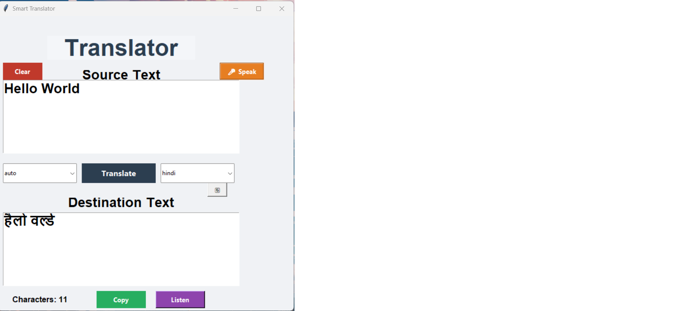

# AI Translator (Python Tkinter)

A desktop translator application built with Python using Tkinter.

This application allows users to translate text between multiple languages, use voice input, listen to translated speech, and track character counts.

---

## Features

- Language translation
- Voice input using microphone
- Text-to-speech output
- Character counter
- Copy translated text
- Clear input fields
- Language selection dropdown

---

## Tech Stack

- Python
- Tkinter (GUI)
- deep-translator
- SpeechRecognition
- pyttsx3

---

## Installation

Clone the repository:

g## Installation

Clone the repository:

```bash
git clone (https://github.com/ManavCodingspace/ai-translator-python-app.git)
```

Navigate to the project folder:

```bash
cd ai-translator-python
```

Install dependencies:

```bash
pip install -r requirements.txt
```

Run the application:

```bash
python main.py
```

## Screenshots




## Future Improvements

- Dark mode UI
- Translation history
- Export translations
- Web version of the translator

---

## License

This project is open source and available under the MIT License.